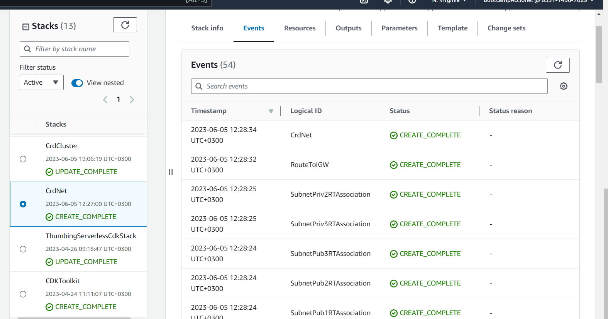
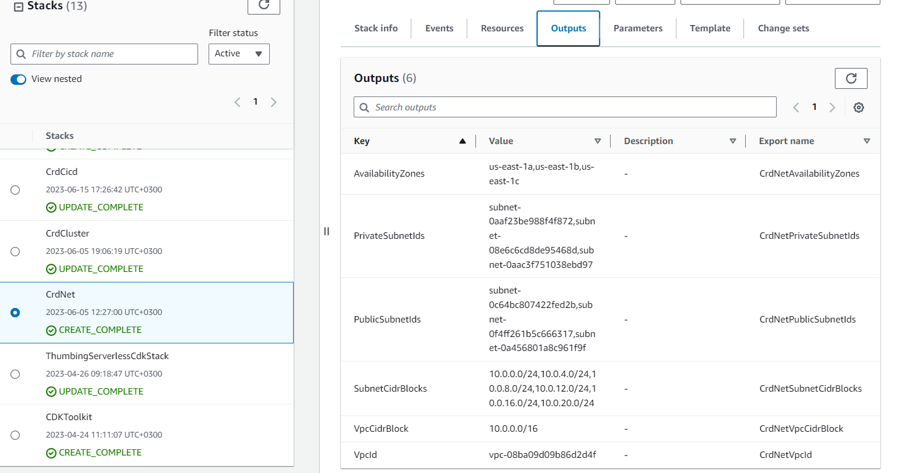
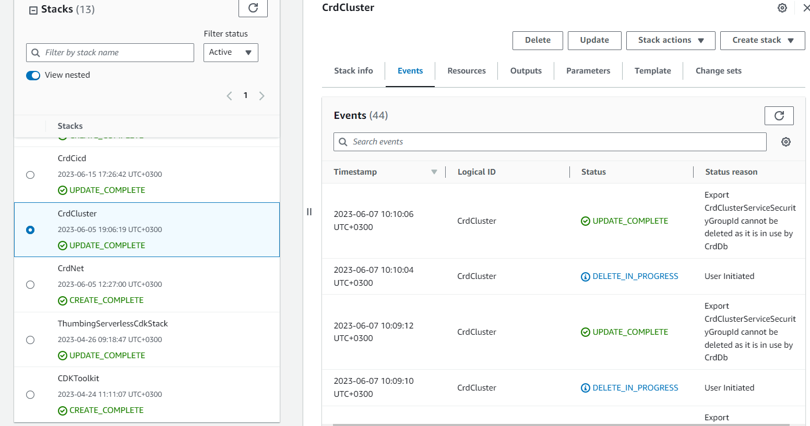
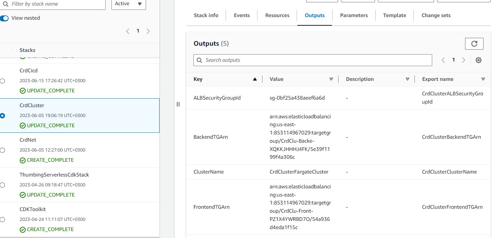

# Week 10 — CloudFormation Part 1
- CloudFormation validation template example:
aws cloudformation validate-template --template-body file:///workspace/aws-bootcamp-cruddur-2023/aws/cfn/template.yaml
- another way to debug is to use CLoudFormation lint. We need to run the following command to install it:
`pip install cfn-lint`
- we need to install cargo, for CFN guard. This will allow us to write Policy as Code:
`cargo install cfn-guard`

## CloudFormation (CFN) Network Layer
- we'll create the following script, to deploy the network stack:
```sh
#! /usr/bin/env bash

set -e # stop the execution of the script if it fails

CFN_PATH="/workspace/aws-bootcamp-cruddur-2023/aws/cfn/networking/template.yaml"
CONFIG_PATH="/workspace/aws-bootcamp-cruddur-2023/aws/cfn/networking/config.toml"

BUCKET=$(cfn-toml key deploy.bucket -t $CONFIG_PATH)
REGION=$(cfn-toml key deploy.region -t $CONFIG_PATH)
STACK_NAME=$(cfn-toml key deploy.stack_name -t $CONFIG_PATH)

cfn-lint $CFN_PATH
aws cloudformation deploy \
  --stack-name $STACK_NAME \
  --s3-bucket $BUCKET \
  --s3-prefix networking \
  --region $REGION \
  --template-file $CFN_PATH \
  --no-execute-changeset \
  --tags group="cruddur-networking" \
  --capabilities CAPABILITY_NAMED_IAM

```
- after we run this script, we can check if everything is working fine by observing the CrdNet stack:




## CFN Cluster Layer
- we need this layer to define our Fargate cluster;
- we'll create and use the following script:
```sh
#! /usr/bin/env bash

set -e # stop the execution of the script if it fails

CFN_PATH="/workspace/aws-bootcamp-cruddur-2023/aws/cfn/cluster/template.yaml"
CONFIG_PATH="/workspace/aws-bootcamp-cruddur-2023/aws/cfn/cluster/config.toml"

cfn-lint $CFN_PATH

BUCKET=$(cfn-toml key deploy.bucket -t $CONFIG_PATH)
REGION=$(cfn-toml key deploy.region -t $CONFIG_PATH)
STACK_NAME=$(cfn-toml key deploy.stack_name -t $CONFIG_PATH)
PARAMETERS=$(cfn-toml params v2 -t $CONFIG_PATH)

aws cloudformation deploy \
  --stack-name $STACK_NAME \
  --s3-bucket $BUCKET \
  --s3-prefix cluster \
  --region $REGION \
  --template-file $CFN_PATH \
  --no-execute-changeset \
  --tags group="cruddur-cluster" \
  --parameter-overrides $PARAMETERS \
  --capabilities CAPABILITY_NAMED_IAM
```
- next we check that the stack is created and working properly:



