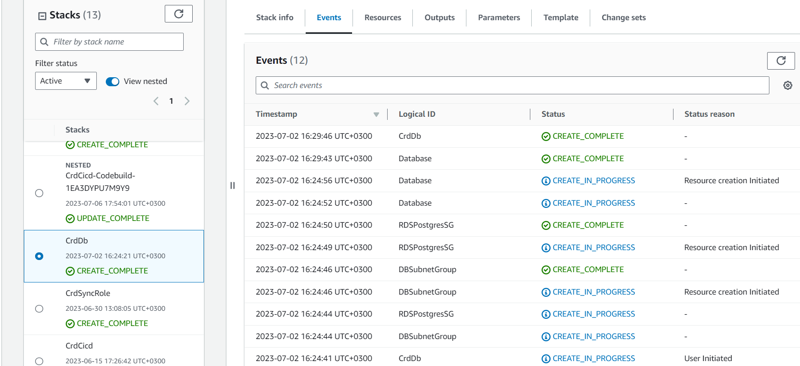

# Week 10 — CloudFormation
- AWS CloudFormation is a service provided by Amazon Web Services that enables users to model and manage infrastructure resources in an automated and secure manner. Using CloudFormation, developers can define and provision AWS infrastructure resources using a JSON or YAML formatted Infrastructure as Code template. 
- CloudFormation validation template example:
aws cloudformation validate-template --template-body file:///workspace/aws-bootcamp-cruddur-2023/aws/cfn/template.yaml
- another way to debug is to use CLoudFormation lint. We need to run the following command to install it:
`pip install cfn-lint`
- we need to install cargo, for CFN guard. This will allow us to write Policy as Code:
`cargo install cfn-guard`

## CloudFormation (CFN) Network Layer
- we'll create the following script, to deploy the network stack:
```sh
#! /usr/bin/env bash

set -e # stop the execution of the script if it fails

CFN_PATH="/workspace/aws-bootcamp-cruddur-2023/aws/cfn/networking/template.yaml"
CONFIG_PATH="/workspace/aws-bootcamp-cruddur-2023/aws/cfn/networking/config.toml"

BUCKET=$(cfn-toml key deploy.bucket -t $CONFIG_PATH)
REGION=$(cfn-toml key deploy.region -t $CONFIG_PATH)
STACK_NAME=$(cfn-toml key deploy.stack_name -t $CONFIG_PATH)

cfn-lint $CFN_PATH
aws cloudformation deploy \
  --stack-name $STACK_NAME \
  --s3-bucket $BUCKET \
  --s3-prefix networking \
  --region $REGION \
  --template-file $CFN_PATH \
  --no-execute-changeset \
  --tags group="cruddur-networking" \
  --capabilities CAPABILITY_NAMED_IAM

```
- after we run this script, we can check if everything is working fine by observing the CrdNet stack:


## CFN Cluster Layer
- we need this layer to define our Fargate cluster;
- we'll create and use the following script:
```sh
#! /usr/bin/env bash

set -e # stop the execution of the script if it fails

CFN_PATH="/workspace/aws-bootcamp-cruddur-2023/aws/cfn/cluster/template.yaml"
CONFIG_PATH="/workspace/aws-bootcamp-cruddur-2023/aws/cfn/cluster/config.toml"

cfn-lint $CFN_PATH

BUCKET=$(cfn-toml key deploy.bucket -t $CONFIG_PATH)
REGION=$(cfn-toml key deploy.region -t $CONFIG_PATH)
STACK_NAME=$(cfn-toml key deploy.stack_name -t $CONFIG_PATH)
PARAMETERS=$(cfn-toml params v2 -t $CONFIG_PATH)

aws cloudformation deploy \
  --stack-name $STACK_NAME \
  --s3-bucket $BUCKET \
  --s3-prefix cluster \
  --region $REGION \
  --template-file $CFN_PATH \
  --no-execute-changeset \
  --tags group="cruddur-cluster" \
  --parameter-overrides $PARAMETERS \
  --capabilities CAPABILITY_NAMED_IAM
```
- next we check that the stack is created and working properly:


## CFN Service Layer
- this is the layer where we define our backend infrastructure;
- we'll create and run the following script:
```sh
#! /usr/bin/env bash
set -e # stop the execution of the script if it fails

CFN_PATH="/workspace/aws-bootcamp-cruddur-2023/aws/cfn/service/template.yaml"
CONFIG_PATH="/workspace/aws-bootcamp-cruddur-2023/aws/cfn/service/config.toml"
echo $CFN_PATH

cfn-lint $CFN_PATH

BUCKET=$(cfn-toml key deploy.bucket -t $CONFIG_PATH)
REGION=$(cfn-toml key deploy.region -t $CONFIG_PATH)
STACK_NAME=$(cfn-toml key deploy.stack_name -t $CONFIG_PATH)
PARAMETERS=$(cfn-toml params v2 -t $CONFIG_PATH)

aws cloudformation deploy \
  --stack-name $STACK_NAME \
  --s3-bucket $BUCKET \
  --s3-prefix backend-service \
  --region $REGION \
  --template-file $CFN_PATH \
  --no-execute-changeset \
  --tags group="cruddur-backend-flask" \
  --parameter-overrides $PARAMETERS \
  --capabilities CAPABILITY_NAMED_IAM

```
- after running it, we'll go to the CFN page and inspect the stack:


## CFN Database Layer

- we create and run the following script:
```sh
#! /usr/bin/env bash
set -e # stop the execution of the script if it fails

CFN_PATH="/workspace/aws-bootcamp-cruddur-2023/aws/cfn/db/template.yaml"
CONFIG_PATH="/workspace/aws-bootcamp-cruddur-2023/aws/cfn/db/config.toml"
echo $CFN_PATH

cfn-lint $CFN_PATH

BUCKET=$(cfn-toml key deploy.bucket -t $CONFIG_PATH)
REGION=$(cfn-toml key deploy.region -t $CONFIG_PATH)
STACK_NAME=$(cfn-toml key deploy.stack_name -t $CONFIG_PATH)
PARAMETERS=$(cfn-toml params v2 -t $CONFIG_PATH)

aws cloudformation deploy \
  --stack-name $STACK_NAME \
  --s3-bucket $BUCKET \
  --s3-prefix db \
  --region $REGION \
  --template-file $CFN_PATH \
  --no-execute-changeset \
  --tags group="cruddur-db" \
  --parameter-overrides $PARAMETERS MasterUserPassword=$DB_PASSWORD \
  --capabilities CAPABILITY_NAMED_IAM
```
- after that we'll check the stack in the CFN page:


## CFN DynamoDB Layer

- we'll create and run the followint script, to build the DynamoDB stack:

```sh
#! /usr/bin/env bash
set -e # stop the execution of the script if it fails

FUNC_DIR="/workspace/aws-bootcamp-cruddur-2023/ddb/cruddur-messaging-stream"
TEMPLATE_PATH="/workspace/aws-bootcamp-cruddur-2023/ddb/template.yaml"
CONFIG_PATH="/workspace/aws-bootcamp-cruddur-2023/ddb/config.toml"

sam validate -t $TEMPLATE_PATH

echo "== build"
# https://docs.aws.amazon.com/serverless-application-model/latest/developerguide/sam-cli-command-reference-sam-build.html
# --use-container
# use container is for building the lambda in a container
# it's still using the runtimes and its not a custom runtime
sam build \
--use-container \
--config-file $CONFIG_PATH \
--template-file $TEMPLATE_PATH \
--base-dir $FUNC_DIR 
# --parameter-overrides 
```
