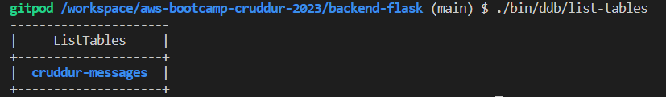
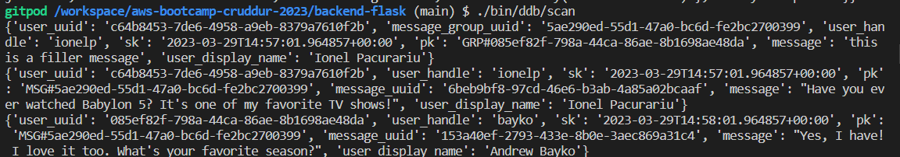
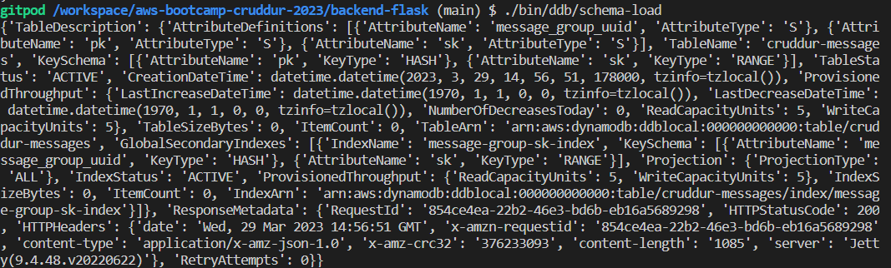
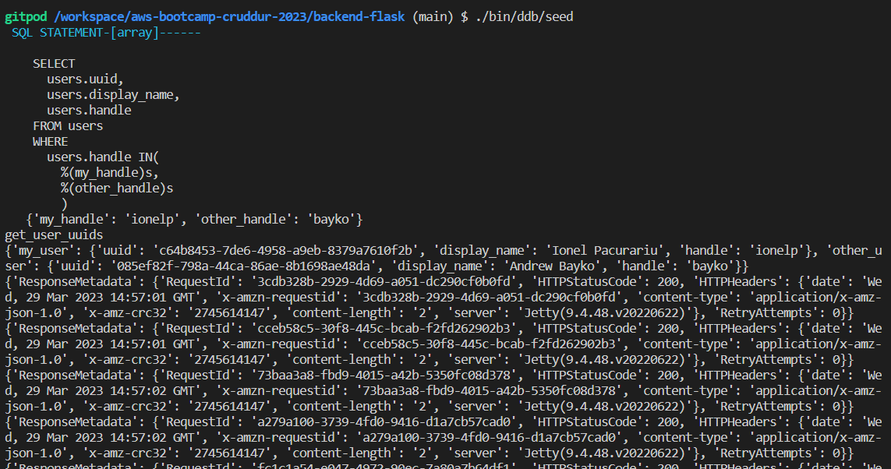
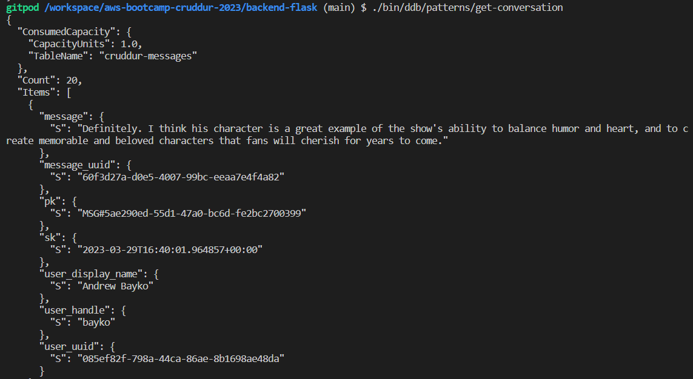
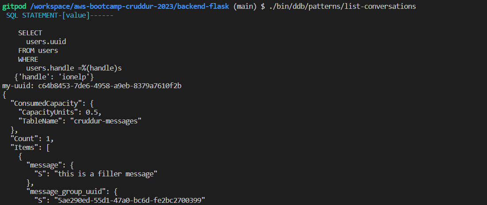
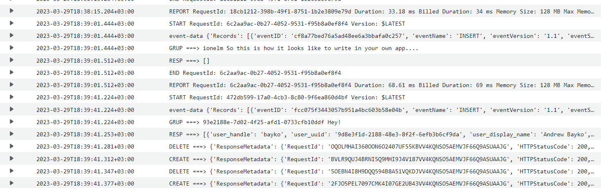

# Week 5 — DynamoDB and Serverless Caching
- we'll be making some data implementations for DynamoDB using DynamoDB Local;
- we start by adding into our `docker-compose.yml` file the following code:
```bash
dynamodb-local:
  # https://stackoverflow.com/questions/67533058/persist-local-dynamodb-data-in-volumes-lack-permission-unable-to-open-databa
  # We needed to add user:root to get this working.
    user: root
    command: "-jar DynamoDBLocal.jar -sharedDb -dbPath ./data"
    image: "amazon/dynamodb-local:latest"
    container_name: dynamodb-local
    ports:
      - "8000:8000"
    volumes:
      - "./docker/dynamodb:/home/dynamodblocal/data"
    working_dir: /home/dynamodblocal
```
- for our DynamoDB database, in the folder `bin/ddb` we'll create the following scripts:
    - `drop` - this will be used to delete the existing table;
      * if we get an error, similar to this:
      ```log
      ERROR:  database "your_db" is being accessed by other users
      DETAIL:  There is 1 other session using the database.
      ```
      * we can get rid of it by typing the following lines into the database command line:
      ```sql
      REVOKE CONNECT ON DATABASE <mydbname> FROM public;
      ALTER DATABASE <mydbname> allow_connections = off;
      SELECT pg_terminate_backend(pg_stat_activity.pid) FROM pg_stat_activity WHERE pg_stat_activity.datname = '<mydbname>';
      DROP DATABASE <mydbname>;
      ```
    - `list-tables` - will be used to list the existing tables;

    - `scan` - to scan the existing data;

    - `schema-load` - used to load the schema into our tables;

    - `seed` - so we can seed our tables with data;

    - in `ddb/patterns` we'll create some pattern scripts, `get-conversations` and `list-conversations`;



- we'll need to implement different access patterns, for our DynamoDB database:
  1. <u>Pattern A (Showing a single conversation):</u>
  - A user wants to see a list of messages that belong to a message group. The messages must be ordered by the created_at timestamp from newest to oldest (DESC)
  2. <u>Pattern B (Showing the list of conversations):</u>
  - A user wants to see a list of previous conversations. These conversations are listed from newest to oldest (DESC). We want to see the other person we are talking to. We want to see the last message (from whomever) in summary.
  3. <u>Pattern C (Create a message):</u>
  - Used to create a message for an existing message group into our app.
  4. <u>Pattern D (Update a message group):</u>
  - Used to create a message for a new message group.

- we'll also create a DynamoDB stream in AWS, to update an existing messaging group;

- for this we will need a VPC endpoint for dynamoDB service on our VPC;

- also we need to create a Lambda function:

```bash
import json
import boto3
from boto3.dynamodb.conditions import Key, Attr

dynamodb = boto3.resource(
 'dynamodb',
 region_name='us-east-1',
 endpoint_url="http://dynamodb.us-east-1.amazonaws.com"
)

def lambda_handler(event, context):
  print('event-data',event)

  eventName = event['Records'][0]['eventName']
  if (eventName == 'REMOVE'):
    print("skip REMOVE event")
    return
  pk = event['Records'][0]['dynamodb']['Keys']['pk']['S']
  sk = event['Records'][0]['dynamodb']['Keys']['sk']['S']
  if pk.startswith('MSG#'):
    group_uuid = pk.replace("MSG#","")
    message = event['Records'][0]['dynamodb']['NewImage']['message']['S']
    print("GRUP ===>",group_uuid,message)
    
    table_name = 'cruddur-messages'
    index_name = 'message-group-sk-index'
    table = dynamodb.Table(table_name)
    data = table.query(
      IndexName=index_name,
      KeyConditionExpression=Key('message_group_uuid').eq(group_uuid)
    )
    print("RESP ===>",data['Items'])
    
    # recreate the message group rows with new SK value
    for i in data['Items']:
      delete_item = table.delete_item(Key={'pk': i['pk'], 'sk': i['sk']})
      print("DELETE ===>",delete_item)
      
      response = table.put_item(
        Item={
          'pk': i['pk'],
          'sk': sk,
          'message_group_uuid':i['message_group_uuid'],
          'message':message,
          'user_display_name': i['user_display_name'],
          'user_handle': i['user_handle'],
          'user_uuid': i['user_uuid']
        }
      )
      print("CREATE ===>",response)
```
- we have to enable streams on the table with 'new image' attributes included;
- we add our function as a trigger on the stream;
- we grant the lambda IAM role permission to read the DynamoDB stream events and to update table items;

