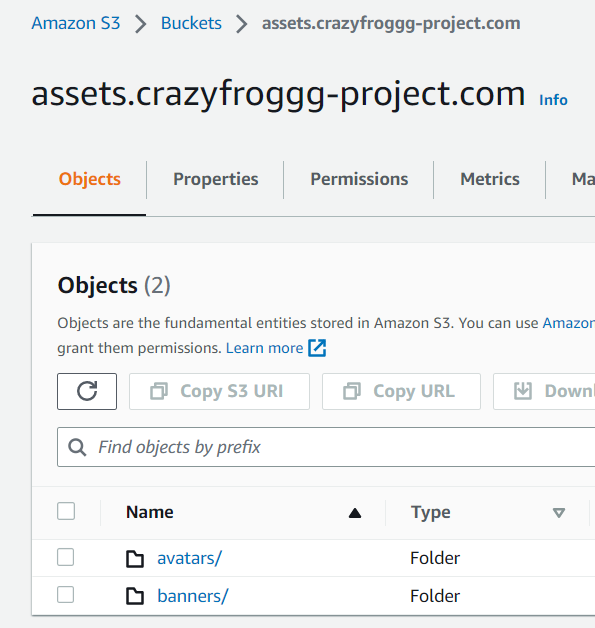

# Week 8 — Serverless Image Processing

The task for this week was to implement the user avatar image, using IaC(infrastructure as code) tools like AWS CDK and CloudFormation.

## <u>Implement CDK stack</u>
- first we'll create a S3 bucket to store the uploaded images, `crazyfrog-uploaded-avatars`;
- next we'll create a bucket, `assets.crazyfroggg-project.com` (your domain name) which will be used to serve the processed images to our application. This bucket will contain 2 folders, `avatars/` and `banners/`;
- we will create a lambda function, through CDK, in order to set some specific properties to the image. For this we'll set up the following `.js` files:
***
`/aws/lambdas/process-images/s3-image-processing.js`
***
```js
const sharp = require('sharp');
const { S3Client, PutObjectCommand, GetObjectCommand } = require("@aws-sdk/client-s3");

function getClient(){
  const client = new S3Client();
  return client;
}

async function getOriginalImage(client,srcBucket,srcKey){
  console.log('get==')
  const params = {
    Bucket: srcBucket,
    Key: srcKey
  };
  console.log('params',params)
  const command = new GetObjectCommand(params);
  const response = await client.send(command);

  const chunks = [];
  for await (const chunk of response.Body) {
    chunks.push(chunk);
  }
  const buffer = Buffer.concat(chunks);
  return buffer;
}

async function processImage(image,width,height){
  const processedImage = await sharp(image)
    .resize(width, height)
    .jpeg()
    .toBuffer();
  return processedImage;
}

async function uploadProcessedImage(client,dstBucket,dstKey,image){
  console.log('upload==')
  const params = {
    Bucket: dstBucket,
    Key: dstKey,
    Body: image,
    ContentType: 'image/jpeg'
  };
  console.log('params',params)
  const command = new PutObjectCommand(params);
  const response = await client.send(command);
  console.log('repsonse',response);
  return response;
}

module.exports = {
  getClient: getClient,
  getOriginalImage: getOriginalImage,
  processImage: processImage,
  uploadProcessedImage: uploadProcessedImage
}
```
***
`/aws/lambdas/process-images/index.js`
***
```js
const process = require('process');
const {getClient, getOriginalImage, processImage, uploadProcessedImage} = require('./s3-image-processing.js')
const path = require('path');

const bucketName = process.env.DEST_BUCKET_NAME
const folderInput = process.env.FOLDER_INPUT
const folderOutput = process.env.FOLDER_OUTPUT
const width = parseInt(process.env.PROCESS_WIDTH)
const height = parseInt(process.env.PROCESS_HEIGHT)

client = getClient();

exports.handler = async (event) => {
  const srcBucket = event.Records[0].s3.bucket.name;
  const srcKey = decodeURIComponent(event.Records[0].s3.object.key.replace(/\+/g, ' '));
  console.log('srcBucket',srcBucket)
  console.log('srcKey',srcKey)

  const dstBucket = bucketName;

  filename = path.parse(srcKey).name
  const dstKey = `${folderOutput}/${filename}.jpg`
  console.log('dstBucket',dstBucket)
  console.log('dstKey',dstKey)

  const originalImage = await getOriginalImage(client,srcBucket,srcKey)
  const processedImage = await processImage(originalImage,width,height)
  await uploadProcessedImage(client,dstBucket,dstKey,processedImage)
};
```
***
`/aws/lambdas/process-images/test.js`
***
```js
const {getClient, getOriginalImage, processImage, uploadProcessedImage} = require('./s3-image-processing.js')

async function main(){
  client = getClient()
  const srcBucket = 'cruddur-thumbs'
  const srcKey = 'avatar/original/crazyfrog.jpg'
  const dstBucket = 'cruddur-thumbs'
  const dstKey = 'avatar/processed/crazyfrog.png'
  const width = 256
  const height = 256

  const originalImage = await getOriginalImage(client,srcBucket,srcKey)
  console.log(originalImage)
  const processedImage = await processImage(originalImage,width,height)
  await uploadProcessedImage(client,dstBucket,dstKey,processedImage)
}

main()
```
***
- to initialize CDK and install its packages, inside the directory `thumbing-serverless-cdk` we'll run in the terminal the following commands:
```
touch .env.example
npm install aws-cdk -g
cdk init app --language typescript
npm install dotenv
```
- for our Lambda function to work, we need to setup the `sharp` library(from Node.js). We've prepared a script for this, in `/bin/avatar/build`:
```bash
#! /usr/bin/bash

ABS_PATH=$(readlink -f "$0")
SERVERLESS_PATH=$(dirname $ABS_PATH)
BIN_PATH=$(dirname $SERVERLESS_PATH)
PROJECT_PATH=$(dirname $BIN_PATH)
SERVERLESS_PROJECT_PATH="$PROJECT_PATH/thumbing-serverless-cdk"

cd $SERVERLESS_PROJECT_PATH

npm install
rm -rf node_modules/sharp
SHARP_IGNORE_GLOBAL_LIBVIPS=1 npm install --arch=x64 --platform=linux --libc=glibc sharp
```
- next we will run the commands `cdk synth` (to execute our CDK app), `cdk bootstrap "aws://${AWS_ACCOUNT_ID}/${AWS_DEFAULT_REGION}"` (to provision resources for the AWS CDK) and `cdk deploy` (to deploy our CDK app);

- now if we run the following script from `./bin/avatar/upload`, we'll upload our local image into our `crazyfrog-uploaded-avatars` bucket, which will trigger the lambda function to process the image and upload it into the `assets.crazyfroggg-project.com` bucket.



## <u>Serve avatars via CloudFront</u>
- CloudFront is a content distribution network (CDN) that will help us serve our S3 buckets content in a fast manner;
- to create the distribution we set the origin domain to point to `assets.crazyfroggg-project.com`;
- we will choose the recommended settings for control and set redirect HTTP to HTTPS for the viewer protocol policy;
- next we will choose CachingOptimized, CORS-CustomOrigin as the optional Origin request policy, and SimpleCORS as the response headers policy;
- the alternate domain name will be set as `assets.crazyfroggg-project.com`;
- we'll choose our Custom SSL certificate, issued before in Certificate Manager;
- next we'll update our assets bucket policy with the newly created one;
- we'll create a record via Route 53, turn on alias and route traffic to CloudFront distribution;
[check the image here](https://assets.crazyfroggg-project.com/avatars/processed/crazyfrog.jpg)


## <u>Profile page</u>
- to be able to interact and make changes to the profile page, we need to make some updates in the backend and frontend files.

## <u>Backend database migration</u>
- we've added a new value for our user info, bio, therefore we need to migrate the database. We'll use some scripts for this, aswell as for users to update and save bio into the database;
- in `bin/generate/migration` we'll put the following script:
```py
#!/usr/bin/env python3
import time
import os
import sys

if len(sys.argv) == 2:
  name = sys.argv[1]
else:
  print("pass a filename: eg. ./bin/generate/migration add_bio_column")
  exit(0)

timestamp = str(time.time()).replace(".","")

filename = f"{timestamp}_{name}.py"

# covert undername name to title case eg. add_bio_column -> AddBioColumn
klass = name.replace('_', ' ').title().replace(' ','')

file_content = f"""
from lib.db import db

class {klass}Migration:
  def migrate_sql():
    data = \"\"\"
    \"\"\"
    return data
  def rollback_sql():
    data = \"\"\"
    \"\"\"
    return data

  def migrate():
    db.query_commit({klass}Migration.migrate_sql(),{{
    }})

  def rollback():
    db.query_commit({klass}Migration.rollback_sql(),{{
    }})

migration = AddBioColumnMigration
"""
#remove leading and trailing new lines
file_content = file_content.lstrip('\n').rstrip('\n')

current_path = os.path.dirname(os.path.abspath(__file__))
file_path = os.path.abspath(os.path.join(current_path, '..', '..','backend-flask','db','migrations',filename))
print(file_path)

with open(file_path, 'w') as f:
  f.write(file_content)
```
- running the script from `bin/db/migrate` will add the bio column into our database:
```py
#!/usr/bin/env python3

import os
import sys
import glob
import re
import time
import importlib

current_path = os.path.dirname(os.path.abspath(__file__))
parent_path = os.path.abspath(os.path.join(current_path, '..', '..','backend-flask'))
sys.path.append(parent_path)
from lib.db import db

def get_last_successful_run():
  sql = """
    SELECT last_successful_run
    FROM public.schema_information
    LIMIT 1
  """
  return int(db.query_value(sql,{},verbose=False))

def set_last_successful_run(value):
  sql = """
  UPDATE schema_information
  SET last_successful_run = %(last_successful_run)s
  WHERE id = 1
  """
  db.query_commit(sql,{'last_successful_run': value},verbose=False)
  return value

last_successful_run = get_last_successful_run()

migrations_path = os.path.abspath(os.path.join(current_path, '..', '..','backend-flask','db','migrations'))
sys.path.append(migrations_path)
migration_files = glob.glob(f"{migrations_path}/*")


for migration_file in migration_files:
  filename = os.path.basename(migration_file)
  module_name = os.path.splitext(filename)[0]
  match = re.match(r'^\d+', filename)
  if match:
    file_time = int(match.group())
    if last_successful_run <= file_time:
      mod = importlib.import_module(module_name)
      print('=== running migration: ',module_name)
      mod.migration.migrate()
      timestamp = str(time.time()).replace(".","")
      last_successful_run = set_last_successful_run(timestamp)
```

## <u>Avatar uploading</u>

- for the image upload we will generate a presigned url(we'll do a HTTP request) using the following `function.rb` ruby function:
```ruby
require 'aws-sdk-s3'
require 'json'
# require 'jwt'

def handler(event:, context:)
  puts event
  # return cors headers for preflight check
  if event['routeKey'] == "OPTIONS /{proxy+}"
    puts({step: 'preflight', message: 'preflight CORS check'}.to_json)
    { 
      headers: {
        "Access-Control-Allow-Headers": "*, Authorization",
        "Access-Control-Allow-Origin": "https://3000-pacurariuim-awsbootcamp-k9zr266yvdk.ws-eu96b.gitpod.io",
        "Access-Control-Allow-Methods": "OPTIONS,GET,POST"
      },
      statusCode: 200
    }
  else
    token = event['headers']['authorization'].split(' ')[1]
    puts({step: 'presignedurl', access_token: token}.to_json)

    body_hash = JSON.parse(event["body"])
    extension = body_hash["extension"]

    # decoded_token = JWT.decode token, nil, false
    # cognito_user_uuid = decoded_token[0]['sub']
    cognito_user_uuid = event["requestContext"]["authorizer"]["lambda"]["sub"]

    puts({step:'presignedurl', sub_value: cognito_user_uuid}.to_json)

    s3 = Aws::S3::Resource.new
    bucket_name = ENV["UPLOADS_BUCKET_NAME"]
    object_key = "#{cognito_user_uuid}.#{extension}"

    puts({object_key: object_key}.to_json)

    obj = s3.bucket(bucket_name).object(object_key)
    url = obj.presigned_url(:put, expires_in: 60 * 5)
    url # this is the data that will be returned
    
    body = {url: url}.to_json
    { 
      headers: {
        "Access-Control-Allow-Headers": "*, Authorization",
        "Access-Control-Allow-Origin": "https://3000-pacurariuim-awsbootcamp-k9zr266yvdk.ws-eu96b.gitpod.io",
        "Access-Control-Allow-Methods": "OPTIONS,GET,POST"
      },
      statusCode: 200, 
      body: body 
    }
  end # if 
end # def handler
```
- into the `Gemfile` we'll add the necessary Ruby dependencies, for our function to work:
```ruby
# frozen_string_literal: true

source "https://rubygems.org"

# gem "rails"
gem "aws-sdk-s3"
gem "ox"
gem "jwt"
```
- next we'll run from the terminal the following commands: `bundle init`, `bundle install` and `bundle exec ruby function.rb`. This will generate locally a presigned url for local testing;
- the same `function.rb` function will be used in our Lambda from production, called `CruddurAvatarUpload`. In that Lambda's env variables we need to add `UPLOADS_BUCKET_NAME`;
- for this function we'll create a new policy called `PresignedUrlAvatarPolicy` and attach it to the Lambda:
```json
{
    "Version": "2012-10-17",
    "Statement": [
        {
            "Sid": "VisualEditor0",
            "Effect": "Allow",
            "Action": "s3:PutObject",
            "Resource": "arn:aws:s3:::crazyfrog-uploaded-avatars/*"
        }
    ]
}
```
- inside `lambdas/lambda-authorizer` we'll create a `index.js` file:

```js
"use strict";
const { CognitoJwtVerifier } = require("aws-jwt-verify");
//const { assertStringEquals } = require("aws-jwt-verify/assert");

const jwtVerifier = CognitoJwtVerifier.create({
  userPoolId: process.env.USER_POOL_ID,
  tokenUse: "access",
  clientId: process.env.CLIENT_ID//,
  //customJwtCheck: ({ payload }) => {
  //  assertStringEquals("e-mail", payload["email"], process.env.USER_EMAIL);
  //},
});

exports.handler = async (event) => {
  console.log("request:", JSON.stringify(event, undefined, 2));

  const auth = event.headers.authorization;
  const jwt = auth.split(" ")[1]
  
  try {
    const payload = await jwtVerifier.verify(jwt);
    console.log("Access allowed. JWT payload:", payload);
    return {
        isAuthorized: true,
        "context": {
            "sub": payload.sub
        },
    };
  } catch (err) {
    console.error("Access forbidden:", err);
    return {
        isAuthorized: false,
    };
  }
}; 

```
- next we'll run the command `npm i aws-jwt-verify --save` and download everything from this folder into a zip file;
- the zip file will be used to create another Lambda, `CruddurApiGatewayLambdaAuthorizer`, used to authorize the files that are going to be uploaded. As env variables we need to add `USER_POOL_ID` and `CLIENT_ID`;

- in AWS API Gateway we'll create 2 routed, for our domain `api.crazyfroggg-project.com`:
    - `POST /avatars/key_upload` with authorizer `CruddurJWTAuthorizer`  and integration `CruddurAvatarUpload`;
    - `OPTIONS /{proxy+}` with integration `CruddurAvatarUpload`.
- no need to configure CORS in API Gateway;

