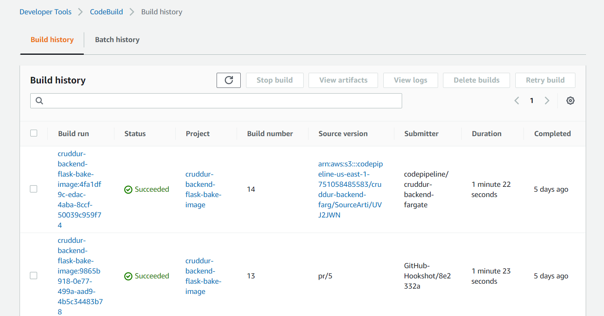
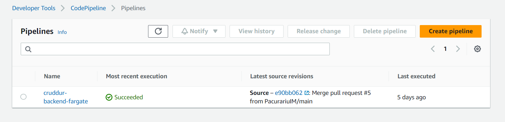
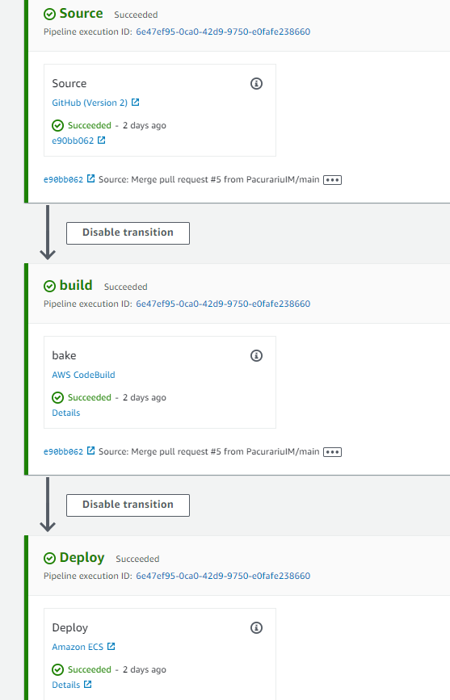

# Week 9 — CI/CD with CodePipeline, CodeBuild and CodeDeploy

- first we'll create in `/backend-flask/buildspec.yml` the following script:
```yml
# Buildspec runs in the build stage of your pipeline.
version: 0.2
phases:
  install:
    runtime-versions:
      docker: 20
    commands:
      - echo "cd into $CODEBUILD_SRC_DIR/backend"
      - cd $CODEBUILD_SRC_DIR/backend-flask
      - aws ecr get-login-password --region $AWS_DEFAULT_REGION | docker login --username AWS --password-stdin $IMAGE_URL
  build:
    commands:
      - echo Build started on `date`
      - echo Building the Docker image...          
      - docker build -t backend-flask .
      - "docker tag $REPO_NAME $IMAGE_URL/$REPO_NAME"
  post_build:
    commands:
      - echo Build completed on `date`
      - echo Pushing the Docker image..
      - docker push $IMAGE_URL/$REPO_NAME
      - cd $CODEBUILD_SRC_DIR
      - echo "imagedefinitions.json > [{\"name\":\"$CONTAINER_NAME\",\"imageUri\":\"$IMAGE_URL/$REPO_NAME\"}]" > imagedefinitions.json
      - printf "[{\"name\":\"$CONTAINER_NAME\",\"imageUri\":\"$IMAGE_URL/$REPO_NAME\"}]" > imagedefinitions.json

env:
  variables:
    AWS_ACCOUNT_ID: 853114967029
    AWS_DEFAULT_REGION: us-east-1
    CONTAINER_NAME: backend-flask
    IMAGE_URL: 853114967029.dkr.ecr.us-east-1.amazonaws.com
    REPO_NAME: backend-flask:latest
artifacts:
  files:
    - imagedefinitions.json
```
- next we'll create a branch `prod` from our main, needed for CodeBuild and CodePipline;

## AWS CodeBuild
- we start by creating a build project, named `cruddur-backend-flask-bake-image`;

- we select Github as source provider, select `cruddur` repo and source version the `prod` branch;
- we select to rebuild every time code is pushed to this repo, single build and event type `PULL_REQUEST_MERGED`;
- for the environment we select the managed image, Amazon Linux 2 for OS, standard runtime, latest version, env type as Linux, privileged;
- we'll create a new service role `codebuild-cruddur-backend-flask-bake-image-service-role`;
- we set timeout 20', no certificates, no VPC, 3GB memory and 2 vCPUs;
- we use our `buildspec.yml` file;
- no artifacts;
- set CloudWatch logs;
- now we can start building it (will also be triggered by a merge to `prod` branch).

## AWS CodePipeline
- we'll create a pipeline `cruddur-backend-fargate` with a new service role (created automatically) `AWSCodePipelineServiceRole-us-east-1-cruddur-backend-fargate`. We select default location and default managed key, in the advanced settings;

- we source stage from Github(v2) and `"Connect to Github"`;
- set connection name `cruddur`, install a new app, select the cruddur repo and press connect;
- next we'll select `prod` branch from the cruddur repo, select "start the pipeline on source code change";
- we'll create the `build` stage by selecting AWS CodeBuild as provider and the newly created project `cruddur-backend-flask-bake-image`;
- for the `deploy` stage we'll select ECS as provider, `cruddur` cluster, `backend-flask` service.
